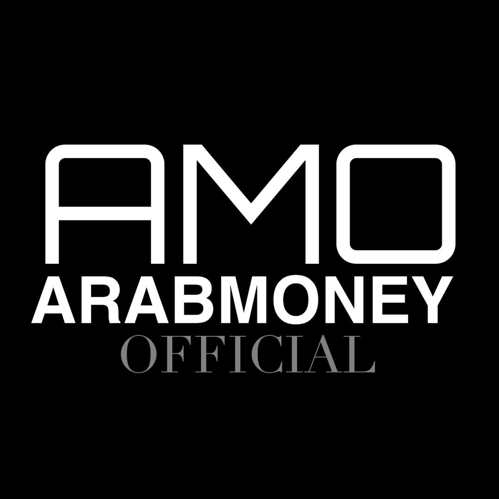

# 🏆 Arab Money Official - Premier Luxury Marketing Authority

<div align="center">
  
  
  [](https://nextjs.org/)
  [](https://www.typescriptlang.org/)
  [](https://tailwindcss.com/)
  [](LICENSE)
</div>

## 🌟 Overview

Arab Money Official (AMO) is the Middle East's premier luxury digital marketing agency, specializing in transforming luxury brands through sophisticated content creation and strategic digital marketing in the MENA region.

**🌐 Live Site:** [Coming Soon]  
**📍 Location:** SHAMS Media City, Dubai, UAE  
**📧 Contact:** hello@arabmoneyofficial.com

## ✨ Key Features

### 🤖 Intelligent Live Chat
- AI-powered instant responses
- Smart keyword routing for services, pricing, and ROI inquiries
- Real-time engagement notifications
- Lead qualification system

### 👑 Exclusive Waiting List
- "By Invitation Only" positioning
- Real-time counter showing demand
- Position tracking for applicants
- Qualification criteria display

### 📊 ROI Calculator
- Interactive projections based on real client data
- 340% average lead increase calculations
- Service tier comparisons
- Visual results dashboard

### 🎨 Premium Design
- Luxury gold color scheme (#D4AF37)
- Glass morphism effects
- Smooth animations with Framer Motion
- Mobile-responsive design

## 🚀 Quick Start

### Prerequisites
- Node.js 18+ 
- npm or yarn
- Git

### Installation

```bash
# Clone the repository
git clone https://github.com/sayedbaharun/AMO_OFFICIAL.git

# Navigate to project directory
cd AMO_OFFICIAL

# Install dependencies
npm install

# Run development server
npm run dev

# Open http://localhost:3000
```

### Build for Production

```bash
# Create production build
npm run build

# Start production server
npm start
```

## 📁 Project Structure

```
AMO_OFFICIAL/
├── app/                    # Next.js 13 app directory
│   ├── layout.tsx         # Root layout with global styles
│   ├── page.tsx           # Homepage
│   ├── about/             # About page
│   ├── services/          # Services page with ROI calculator
│   ├── portfolio/         # Portfolio showcase
│   ├── insights/          # Industry insights and resources
│   └── contact/           # Contact page
├── components/
│   ├── ui/                # UI components
│   │   ├── LiveChat.tsx   # AI-powered chat widget
│   │   ├── WaitingList.tsx # Exclusive waiting list
│   │   └── ROICalculator.tsx # ROI projection tool
│   ├── layout/            # Layout components
│   │   ├── Header.tsx     # Navigation header
│   │   ├── Footer.tsx     # Site footer
│   │   └── ClientWrapper.tsx # Global features wrapper
│   └── home/              # Homepage sections
├── public/                # Static assets
├── lib/                   # Utility functions
└── styles/               # Global styles

```

## 🛠️ Tech Stack

### Frontend
- **Framework:** Next.js 13.5.1 (App Router)
- **Language:** TypeScript 5.2
- **Styling:** Tailwind CSS 3.3
- **Animations:** Framer Motion
- **Icons:** Lucide React

### Key Libraries
- React Hook Form - Form management
- Zod - Schema validation
- date-fns - Date handling
- clsx - Conditional classes
- tailwind-merge - Class merging

## 💼 Services

### 📱 Content Mastery ($2-5K/month)
- Social media management
- Premium content creation
- Analytics & reporting
- Community management

### ⚡ Campaign Excellence ($5-15K/month)
- Everything in Content Mastery
- Influencer partnerships
- Advanced analytics
- Multi-platform campaigns

### 🚀 Luxury Authority ($15K+/month)
- Complete brand transformation
- Event marketing & PR
- Custom development
- Executive consulting

## 📊 Performance Metrics

- **85%** Client retention rate
- **340%** Average lead increase
- **$12.8B** GCC luxury market opportunity
- **100K+** Premium followers

## 🤝 Contributing

This is a proprietary project. For business inquiries, please contact hello@arabmoneyofficial.com

## 📄 License

© 2025 Arab Money Official LLC. All rights reserved.

Licensed in SHAMS Media City, Dubai, UAE.

---

<div align="center">
  <strong>Reviving Legacy, Creating Future</strong>
  
  Built with 💛 in Dubai
</div>
